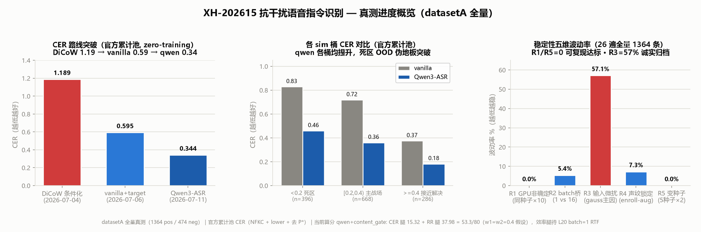

# XH-202615 复杂交互场景的抗干扰语音指令识别技术

> 🏆 **美的集团** 发榜｜挑战杯 / 竞赛赛道

## 📋 项目概述

本项目针对**复杂交互场景下的抗干扰语音指令识别**技术难题，提出了一套完整的 **Target-Speaker ASR（TS-ASR）+ 意图拒识** 解决方案。

### 🎯 核心任务

给定**目标说话人的唤醒音频**，在「带噪 + 多人重叠」的识别音频中：
- ✅ **只转写目标说话人**的语音内容
- ✅ **拒识非目标说话人**的干扰语音
- ✅ 在 **L20 GPU** 上实现实时/近实时推理

### 📊 评分维度

| 维度 | 权重 | 技术重点 |
|------|------|----------|
| 目标 CER | 40% | TS-ASR 转写精度 |
| 拒识率 | 40% | 非目标语音识别与拒绝 |
| 推理效率 | 20% | RTF、显存占用 |

---

## 🚀 最新进展（2026-07-30 全量提交线重跑 + Phase-3 NO-GO）

> **当前提交线**（Qwen + content_gate，含拒 thr0.27）从原始 A 音频全量
> 重跑：累计池 CER **0.6201**（15.20/40）+ RR **94.73%**
>（37.89/40）+ 4060 合并 RTF **0.253**。按当前效率映射估计
> **68.66–73.09 / 100**，L20 近满分时约 **73.09**。逐句 CER 平均为
> 0.7230，若主办方采用该口径则约 64.54–68.97；必须确认官方聚合方法。
> Dataset A 只用于测试，不进入训练、选模或本轮调参。

### 🔴 战略进展线（2026-07-27 ~ 07-30）

- **2026-07-30 Phase-3 frozen-Qwen Sidecar 显著 NO-GO**：synthetic speaker-disjoint val ASR loss `5.7891→4.0566`，但锁定 checkpoint 后 A 集一次性同进程配对 CER `0.342948→0.376458`（Δ`+0.033510`，95% CI `[+0.021655,+0.045744]`）。不租算力扩训、不集成、不用 A 集反调。固定 scene route + content gate 离线 CER `0.6168→0.5919`，约 +0.99 质量分；下一步只在 L20 batch1 验证其端到端总分。详见 [`docs/全量评测与下一步_2026-07-30.md`](docs/全量评测与下一步_2026-07-30.md)。
- **2026-07-29 TSE 阶段二全量 NO-GO（声学翻正，CER 不动）**：实际训 WeSep pBSRNN（160/40 speaker-disjoint triples）+ 5 轮验证全 NO-GO。声学侧明确有效（val SI-SNRi +1.096→+2.264 dB、Qwen mel L1 −31%、wave L1 −43%、RMS 失配 5.04×→0.64×），但冻结 Qwen 配对 CER 1.2870→1.2671（Δ−0.0199，bootstrap CI 跨 0）未过 ΔCER≤−0.05 门槛。**核心发现=感知-识别鸿沟**：separator 声学收益没传导到 ASR CER（印证 EoW 论文）。当时唯一未试的 Phase-3 frozen-Qwen Sidecar 已于 07-30 完成并显著回退，路线现已闭环。详见 `docs/tse_train_plan.md`、`docs/全量评测与下一步_2026-07-30.md`。
- **2026-07-28 分场景路由反转 multi-voice NO-GO（全量 1350 pos 坐实，+0.83 未集成主线）**：按 diar 分 n_spk 路由——单人 40% 走主线不分离 / 重叠 60% SepFormer 分离+二选一。机制：SepFormer 单人破坏 Δ+0.165 / 重叠救回 Δ−0.157，分场景后净正。transcribe CER 0.3427→0.2941（−14.2%）/ 含拒 0.5931→0.5727（−3.4%）。外推 −20.7% 被全量纠正（采样偏差）。多信号拒识 task6 强 NO-GO 放弃（neg RR 损失 36.71% 反噬）。
- **2026-07-27 消除信息隔阂 + 推翻"到顶"**：用户挑战"0.3436 物理天花板"——死区真地板仅 ~10%（非不可修），理论空间 0.3436→~0.15。真瓶颈=双人重叠区物理混合（非 mel 摧毁）。5 路轻量改进全证伪。外部数据训练已解禁（主办方确认）。

### 主线：Qwen3-ASR + 声纹切 target timeline（2026-07-11，zero-training）
复用 enroll_infer 的 DiariZen diar + wespeaker 选 target → 切 target timeline → **Qwen3-ASR-1.7B**（ExtremeNoise 4× 鲁棒迁移，Apache2.0）drop-in 转写。全量 1350 条官方口径：
- **transcribe CER 0.3436**（诊断上限，vs vanilla 0.595）
- **含拒 thr0.27 提交 overall 0.5934**（CER 腿 16.26；**答辩/提交一律报含拒口径**，transcribe 0.3436 是诊断上限勿虚报）

### content_gate 二次拒识（2026-07-18，默认开 BAODI_GATE=1）
对 sim≥thr 的 accept 再判转写是否有效家居指令，非指令（新闻/英文/乱码）加拒。qwen 后端 joint 验证净正 **+0.826**：neg RR 0.9051→**0.9494**（腿 +1.77）/ pos CER 0.5934→0.6171（腿 −0.95）。详见 `code/verify_content_gate_joint.py`。

### 稳定性 / 可复现性闭环（2026-07-19，26 遍全量 1364 条）
- **R1=0**：同种子 10 遍 + 变种子 5×2，transcript 零波动 → greedy argmax 完全确定可复现
- **R2 纯仅 2 条**：batch=1 vs 16 差异 74 条但 72 含 R3/R4 叠加 → 开发数字可外推提交（submit 已锁 batch1）
- **R3 57% 归档**：输入微扰敏感（gauss 加性噪声主因），A 集外训练才能修
- hold-out 纪律：只用工程修复 + 诊断，不碰训练

详见 [`docs/稳定性测试报告_2026-07-19.md`](docs/稳定性测试报告_2026-07-19.md)。

### 前序：2026-07-06 Phase 1（vanilla vs DiCoW 条件化）
DiCoW FDDT/STNO 条件化在极重 babble 下反作用（英文幻觉 18.8%、CER 1.25），改 vanilla Whisper + 声纹切 target，CER 减半到 0.664——此为 qwen 主线前序（07-11 qwen 进一步到 0.3436）。契合出题方反 cascaded 审美。详见 `code/exp_vanilla_vs_dicow.py`。

**提交入口**：`bash code/run_baodi.sh pos|neg [thr]`（锁 `--no-llm` / thr0.27 / sim_only / content_gate 默认开 / `--no-se`；BAODI 守卫防裸调灾难）。

---

## 🏗️ 技术架构

### 整体方案（实际实现）

> ⚠️ **2026-07-06 Phase 1 更新**：下方阶段 2「DiCoW 条件化转写」已被全量真测证伪反作用（英文幻觉 18.8%、CER 1.25）。**实际主线改为 vanilla Whisper + 声纹切 target timeline**（CER 0.664 减半）。⚠️ **2026-07-11 进一步：换 Qwen3-ASR-1.7B（ExtremeNoise 4× 鲁棒迁移）drop-in 转写，CER 降到 transcribe 0.3436 / 含拒提交 overall 0.5934（CER 腿 16.26），见上「最新进展」**。下方 DiCoW 流程作历史 / 已证伪路径保留。

> 已实现于 `code/submit_infer.py`（4 阶段 subprocess 编排）。理想态组件（CAM++/Personal VAD）T18 证伪/未用，详见 [`交付/设计报告.md`](交付/设计报告.md)。

```
识别音频 (recognition.wav)
   │
   ├─[阶段0] noise_classify (谱平坦度)  ─→ 噪声类型 {white / pink / babble}
   │
   ├─[阶段1] SE 条件化降噪 (DeepFilterNet3)
   │         babble/white → atten=0 全力   pink → atten=6 温和（防过消除）
   │         ↓ denoised.wav
   │
   ├─[阶段2] enroll_infer
   │         ├─ DiariZen(wavlm-large) diarization → 各 speaker 时间段
   │         ├─ wespeaker 声纹（enrollment + 各 speaker, 256d）→ 余弦匹配选 target_idx
   │         ├─ STNO mask（sil/target/nontarget/overlap 4 类，FDDT 仿射变换注入 encoder 每层）
   │         └─ DiCoW（Whisper-large-v3-turbo + FDDT）只转 target → transcript
   │
   ├─[阶段3] llm_reject（Qwen2.5-3B-Instruct）
   │         对 transcript 判 accept / reject（零样本，13 类拒识 schema + 自适应 CoT）
   │
   └─[阶段4] 融合（llm_or_sim）
             rejected = (llm ≠ accept) AND (max_sim < sim_thr)   # 默认 sim_thr=0.2
             ↓
   result.json  +  timing.json
```

### 核心技术栈（实际）

| 模块 | 实际方案 | 作用 |
|------|----------|------|
| **声纹锁定** | wespeaker-voceleleb-resnet34（256d，复用 `diar._embedding`） | enrollment → target 余弦匹配（CAM++ T18 per-speaker 公平对照证伪 sim 0.191<0.218，**未用**；Personal VAD **未用**） |
| **说话人分离** | DiariZen（diarizen-wavlm-large-s80-md） | 多 speaker 时间段 |
| **TS-ASR 转写** | **vanilla Whisper-large-v3-turbo + 声纹切 target（Phase 1 新主线，CER 0.664）**；DiCoW（FDDT 条件化）⚠️ 已证伪反作用（CER 1.25） | 只转 target |
| **语音增强** | DeepFilterNet3（条件化，8.7MB） | babble/white → 全力，pink → 温和（=6） |
| **语义拒识** | Qwen2.5-3B-Instruct | 指令合理性，救回声纹误拒 |
| **融合决策** | llm_or_sim | `rejected = (llm ≠ accept) AND (max_sim < 0.2)` |

---

## 📁 项目结构

```
xh-202615-robust-asr/
├── 📦 交付（比赛提交物）
│   ├── 设计报告.md                   # 实际实现版技术方案
│   ├── 使用说明.md                   # submit_infer用法 + 3 venv + 权重 + 格式
│   └── 测试验证方案.md               # 评测指标 + 仿真结果诚实表 + A集流程
│
├── 📄 技术文档
│   ├── 00_技术路线总纲与行动地图.md    # 全局架构与行动计划
│   ├── 01_模块技术细节全解_答辩级.md   # 各模块详细技术方案
│   ├── 02_上限候选深读.md             # 差异化技术方向
│   └── 03_答辩FAQ与风险预案.md        # 答辩准备与风险应对
│
├── 📚 论文资料
│   ├── papers/                        # 原始 PDF 论文
│   ├── _txt/                          # 论文文本提取
│   └── paper_index.md                 # 论文索引与分类
│
├── 💻 代码实现
│   └── code/
│       ├── submit_infer.py              # ⭐ 标准化推理入口（result.json+timing.json）
│       ├── enroll_infer.py              # wespeaker 声纹锁定 + diar + DiCoW 转写
│       ├── se_denoise.py / noise_classify.py  # DeepFilterNet3 条件化降噪 + 噪声估计
│       ├── llm_reject.py                # Qwen2.5-3B 语义拒识
│       ├── eval_metrics.py / eval_full_test.py  # 评测（CER/RTF/拒识率）
│       ├── simulate_pipeline.py / build_dataset.py  # 数据仿真
│       ├── minimal_infer.py / stno_experiment.py    # 机制验证
│       ├── babble_oracle_test.py / vanilla_whisper_test.py / stno_ablation.py  # T22 babble 归因
│       ├── apply_dicow_langfix.py       # DiCoW language 死代码补丁
│       ├── make_readme_progress.py      # README 进度图生成
│       └── experiments/                 # 📦 归档区（CAM++ 证伪 / SE·enroll·LLM·fuse 实验 json + 评测脚本 fuse_eval/eval_se_cer 等 + 诊断）
│
├── 📊 进度与结果
│   ├── PROGRESS.md                    # 开发进度记录
│   ├── RESULTS.md                     # 实测结果与分析
│   └── docs/
│       ├── progress_overview.png        # 📊 README 进度概览图（真测版: 路线突破+sim分桶+稳定性）
│       ├── cer_progress_dashboard.html  # 可交互看板（light/dark 自适应）
│       └── superpowers/                 # 设计稿（plans/specs）
│
└── 📖 论文精读
    ├── 核心论文精读与方案.md
    ├── 论文精读_US-PVAD_超短参考.md
    ├── 论文精读_增强与纠错路线.md
    └── 资料扩展_TS-ASR与开源资产.md
```

---

## 🚀 快速开始

### 环境要求

- Python 3.12+
- PyTorch 2.5+ (CUDA 12.4)
- Transformers 4.42+
- GPU: NVIDIA RTX 4060+ (8GB+)

### 安装依赖

> 主线推理用 3 个独立 venv（依赖冲突不可合并）：`code/.venv`（enroll_infer/DiariZen）、`code/.venv_se`（DeepFilterNet3）、`.venv_llm`（Qwen2.5-3B）。由 uv 管理。详见 [`交付/使用说明.md`](交付/使用说明.md)。

```bash
pip install torch torchvision torchaudio --index-url https://download.pytorch.org/whl/cu124
pip install transformers librosa pyannote.audio
```

### 标准化推理（submit_infer.py，比赛提交入口）

```bash
source code/setenv.sh && export HF_HUB_OFFLINE=1
code/.venv/Scripts/python.exe code/submit_infer.py \
  --enrollment <enr.wav> --recognition-folder <rec_dir> --out-dir out/
# → out/result.json + out/timing.json
```

- 一对一配对：`--pairs <manifest.json>`（`[{enrollment, recognition}, ...]`）
- 降级：`--no-se`（跳 SE）/ `--no-llm`（跳 LLM，显存不足兜底）
- 快测：`--limit N`；策略：`--strategy {llm_or_sim,sim_only,llm_only}`，默认 `--sim-thr 0.2`
- 输出 schema 与常见报错见 [`交付/使用说明.md`](交付/使用说明.md)

### 运行最小推理（机制验证，非提交入口）

```bash
cd code
python minimal_infer.py <audio.wav> [language]
```

**示例输出：**
```
[setup] device=cuda:0 dtype=torch.float16 model=E:/hf_cache/DiCoW_v3_2
[load] 2.6s | params=0.89G
[audio] EN2002a_30s.wav | 30.0s
[infer] 1.73s for 30.0s audio | RTF=0.058
[mem] peak GPU mem=2.13GB
[text] yeah yeah but i do not know about you but usually in windows right click does not do anything...
```

### STNO 控制实验

```bash
python stno_experiment.py
```

验证 FDDT/STNO 机制：
- **全-target**: 转写所有人（398 字）
- **前半 target + 后半 silence**: 只转前半（162 字）
- **全 non-target**: 完全拒识（0 字）✅

---

## 📈 实测结果

### 📊 进度概览（2026-07-20 真测版，datasetA 全量）



> datasetA 全量真测（1364 pos / 474 neg），口径统一**官方累计池**（NFKC + lower + 去 P*）。三子图：
> - **① CER 路线突破**：DiCoW 条件化(1.19) → vanilla+target(0.59) → Qwen3-ASR(0.34)，zero-training 三阶段减半，契合反 cascaded 审美。
> - **② sim 分桶对比**：qwen 各桶均优于 vanilla，死区(<0.2) OOD 伪地板突破（0.83→0.46）。
> - **③ 稳定性五维波动率**：R1/R5=0 可复现达标，R3=57% 输入微扰敏感（gauss 主因，诚实归档）。
>
> 生成 `code/make_readme_progress.py`（数据源 `recompute_official_cer.json` + `qwen_official_cer_workpoints.json` + `poc_qwen_asr_full_result.json` + `stability_matrix/stability_report.json`）。原仿真期看板保留：[`docs/cer_progress_dashboard.html`](docs/cer_progress_dashboard.html)（450 条 mimo-tts 仿真集，非真实 A 集，绝对值不可外推赛榜）。

### 🎯 真测主线算分（2026-07-19，datasetA 全量 1364 pos / 474 neg，qwen + content_gate）

| 腿 | 指标 | 值 | 腿分 |
|---|---|---|---|
| CER 40% | 含拒 thr0.27 overall | 0.5934 →（+gate）0.6171 | **15.32** |
| RR 40% | neg 拒识率 | 0.9051 →（+gate）0.9494 | **37.98** |
| 效率 20% | overall_rtf（关 SE，4060）| 0.142 | 待 L20 batch=1 |
| **合计** | | | **53.3 / 80** |

> w1=w2=0.4 假设（排名公式 `TotalScore = w1*(1−CER) + w2*RR`，权重待主办方确认）。CER 一律报含拒口径（transcribe 0.3436 是诊断上限勿虚报）。下方 DiCoW Baseline / 仿真进度图为历史 / 前序数据。

### DiCoW Baseline 性能

| 指标 | 值 | 备注 |
|------|-----|------|
| 模型参数量 | **0.89G** | Whisper-large-v3-turbo |
| 加载时间 | 2.6s | - |
| 推理时间 (30s) | 1.73s | RTX 4060 |
| **RTF** | **0.058** | 远快于实时 |
| 峰值显存 | 2.13GB | 8GB 显存绰绰有余 |

### STNO 控制验证

| STNO 构造 | 输出 | 结论 |
|-----------|------|------|
| 全-target | 398 字 | 完整转写 |
| 前半 target + 后半 silence | 162 字 | 精确控制 ✅ |
| 全 non-target | **0 字** | **内建拒识机制** ✅ |

**核心结论**: FDDT 的 STNO 条件化可验证、可控——target 转写、silence 跳过、non-target 直接产出空（拒识）。拒识不是后处理，是 FDDT 内建机制。

---

## 📚 核心论文

本项目基于以下关键论文：

1. **DiCoW** (2501.00114) - 目标说话人条件化 ASR
2. **SE-DiCoW** (2601.19194) - 增强版 DiCoW
3. **FDDT** (2409.09543) - 仿射变换控制机制
4. **US-PVAD** - 超短参考 Personal VAD
5. **Reject-or-Not** (2512.10257) - LLM 拒识基准
6. **RASTAR** (2602.12287) - 检索增强纠错

详见 [`papers/`](papers/) 目录和 [`paper_index.md`](paper_index.md)。

---

## 🎯 技术亮点（真测主线，2026-07-19）

1. **target timeline extraction + Qwen3-ASR**: diar(DiariZen) + wespeaker 选 target → 切 target timeline（含重叠区）→ Qwen3-ASR-1.7B（ExtremeNoise 4× 鲁棒）转写。zero-training，CER 从 DiCoW 条件化 1.19 降到 **0.3436**（诊断）/ 0.5934（含拒提交）
2. **声纹 max_sim 锁定 + content_gate 二次拒识**: 声纹锚信号（`max_sim ≥ thr0.27`）锁定 target；对 accept 再判转写是否有效家居指令（`content_gate`），非指令加拒。neg RR **0.9494**（+gate 后），joint 净正 +0.826
3. **关 SE 的工程诚实（Pareto 最优）**: 07-18 SE orphan bug bugfix 坐实 SE 原空转 30.6% RTF，bugfix 后 SE 真生效反致 CER +0.1049 恶化（三机制）→ **关 SE 省 30% RTF 且 CER 更优**
4. **可复现性量化达标**: 26 遍全量 1364 条，R1（同种子×10）+ R5（变种子×5）transcript **零波动** → greedy argmax 完全确定；R2 纯仅 2 条 → 开发数字可外推提交 batch=1
5. **hold-out 纪律 + 诚实归因**: A 集是测试集，zero-training 不碰训练；R3 57% 输入微扰敏感（gauss 主因）诚实归档，给根因 + 未来方向（A 集外加噪训练）

---

## 📅 项目推进时间线

> 手机查看友好版。详细日志 [`PROGRESS.md`](PROGRESS.md)，结果 [`RESULTS.md`](RESULTS.md)。

### ✅ 已完成（06-27 → 06-30）

| 日期 | 阶段 | 关键产出 |
|---|---|---|
| 06-27 | W1 minimal 推理 | DiCoW 跑通：RTF=0.058 / 0.89G params / 峰值 2.13GB，解除"零实测"红线 |
| 06-27 | STNO 机制验证 | target→转 / silence→跳 / non-target→0字拒识（FDDT 内建拒识）|
| 06-27 | W6 评测 + W2 仿真 | `eval_metrics.py`(CER/RTF/拒识) + `simulate_pipeline.py`(SNR+重叠矩阵) |
| 06-28 | **T14** 完整端到端 pipeline | diar+STNO+DiCoW 真 target-speaker 转写，PIPELINE_EXIT=0 |
| 06-28 | 中文 CER=0 + 重叠诊断 | mimo-tts 合成；重叠 0/50/100% → CER 0.00/0.13/1.00（100% 单通道死区）|
| 06-28 | **T17** enrollment 锁定 target | `enroll_infer.py` 干净场景 sim0.816/CER=0；450 条画像 87%拒/4%正确 |
| 06-29 | **T18** 三线 de-risk | SE增强(CER 4.27→3.65) / CAM++证伪(维持 wespeaker) / LLM拒识 F1=0.878 |
| 06-29 | **T19** 集成 + langfix 修复 | `fuse_eval.py` 真实组合指标；修 DiCoW language 死代码 bug（英文 90%→72%）|
| 06-30 | **T20** SE 条件化 post-fix 重评 | =6 优于 =0（最优精细 2.022）；babble 归因深化（diar 误检+STNO 崩）|

### ✅ 07 月真测进展（datasetA 到手 → qwen 主线 → 稳定性闭环）

| 日期 | 阶段 | 关键产出 |
|---|---|---|
| 07-04 | **T23** 真测基线 | datasetA 到手（单通道 16k）；pos CER ~1.0 / neg RR 77%；**单通道确认，空间路线全弃** |
| 07-06 | **T24** Phase 1 突破 | H3 证伪 DiCoW 条件化（反作用）；vanilla+target CER **0.664** 减半 |
| 07-08 | **T27** 口径坐实 | 主办方 CER 脚本（NFKC + 去 P* 累计池）；统一 **thr=0.27** 定稿；修提交归一漏洞 |
| 07-11 | **T28** qwen 突破 | Qwen3-ASR transcribe CER **0.3436** / 含拒 0.5934（CER 腿 16.26）；FireRedASR 横评双 SOTA |
| 07-14 | 多声纹 LLM 路由 POC | 证伪（端到端挑不到 target）；content_gate v2 集成探索 |
| 07-18 | 效率腿 + content_gate | **SE orphan bug 真相**（关 SE 省 30% RTF，Pareto 最优）；content_gate 反转默认开（joint +0.826） |
| 07-19 | **稳定性闭环** | 26 遍全量：R1=0 完全确定 / R2 纯仅 2 条 / R3 57% 归档；submit 锁 batch=1 |

### 🔄 当前重心（2026-07-19 后：答辩 + 效率腿 L20 实测）

真测 + 稳定性闭环完成，当前算分 **53.3/80**（qwen + content_gate，w1=w2=0.4）：

- 📄 **答辩准备**（最高 ROI）：算分 / FAQ / README / 进度图 已刷到 07-19；待演练稿
- ⚡ **效率腿 L20 实测**（等租算力）：4060 关 SE overall_rtf 0.142，L20 batch=1 待测；`deploy_l20.sh` 就绪
- ❓ **命门 — 问主办方**：排名公式 w1/w2 值 + RTF 计时口径（含加载?）+ 效率打分范式

### ⏭ 未来里程碑

| 里程碑 | 预估 | 依赖 |
|---|---|---|
| 推理脚本标准化（json+耗时）| 1-2 天 | 无 |
| 设计报告 + 使用说明 | 2-3 天 | 无 |
| 测试集 A 真实评测 | 1-2 天 | **测试集 A** |
| L20/L40 耗时验证 | 1 天 | 租云 |
| 测试报告 | 1-2 天 | 真实 A 结果 |
| **作品提交** | — | ≤ **2026-09-05** |

### 📋 官方交付物清单

- [ ] 模型权重（DiCoW + diarizen + wespeaker + Qwen-2.5-3B）
- [ ] 推理脚本（python，吃 A → json 结果）
- [ ] json 测试结果 + 运行耗时
- [ ] 技术设计方案 + 测试验证方案 + 使用说明
- 评分：CER 40% / RR 40% / 效率 20%（L20 GPU）

---

## 🤝 贡献指南

本项目为竞赛项目，欢迎：
- 技术讨论与方案建议
- Bug 报告与修复
- 性能优化 PR

---

## 📄 License

本项目仅供学术研究与竞赛使用。

---

## 📧 联系方式

- GitHub: [@Panda_Lorrain](https://github.com/Panda_Lorrain)
- Issues: [项目 Issues](https://github.com/Panda_Lorrain/xh-202615-robust-asr/issues)

---

<div align="center">
  <sub>🏆 美的集团 XH-202615 挑战赛</sub>
</div>
